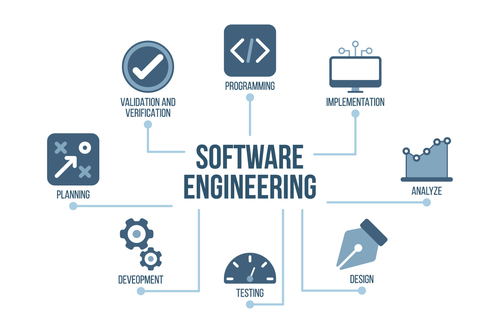

## What brings me into this?

Since when I was a kid, I’ve been attracted to the game world, such as Raiden, Super Mario, Street Fight, Metal Slug, and much more. I was so into the plot that each game brings me, and the fun time they create to me and my family, which it become something more than a game, it become a area I want to develop in the future. Even today, I’m still interested in gaming development. Software engineering is a major that covers lots of skill in making things on a machine, not only game development, it teaches much more skill of creating things on a computer. In this Fast-paced age, I believe that software engineering can keep me connected to the world, and the capability to bring technology that convenience the world.

## What it brings me to?

Over the course of two years, I have a higher understanding of software engineering. From the first time I type one line of code, a function, a program, even a minigame, it helps me to become a better thinker, programmer, and capable of solving hard problems. Even though it does cause lots of stress and pressure, but each time when you solve the problem, the experience that it brings to you is much more worthwhile.

## What I looking forward ...

In the future, there many skills that I want to develop and learn as a software engineer. Such as the ability to create a fancy website, which requires me to master many programming languages like java, javascript, HTML, CSS, and more. Also for game development, which is my goal from childhood, I want to learn about the uses of the different game engines, such as unity, unreal. Phone app development will be also one of the areas that I’m looking forward to since this area has huge potential in the future, It is very necessary for me to learn how to create a phone app that convenient in real life.
