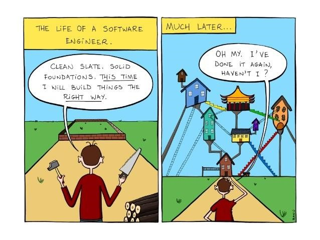

## Faster, Easier, and Smarter

You notice that there is always a reusable solution for the same type of problem, for example, in math, we always use height times width to calculate the area of a rectangle, in physics, we always use distance divide by time to calculate the speed. Of course, we also have a reusable solution for coding problems, and that what we called design pattern. At first, this idea was discovered by Christopher Alexandr, that a design pattern is a reusable solution to a commonly occurring problem within a given context in software design. By using and following the right design pattern into code, it saves you time and your brain cell, because by start code with random parts, the design pattern gives you a clear instruction of what you need to code in each section of the problem, and it’s very flexible that there is so many design pattern that you can choose which one works more efficiently on your coding problem.

## How it occurs in our coding

For most of the time, we all following some type of design pattern that we didn’t even notice during the coding. There are three main design patterns in software engineering, creational, structural, and behavioral. The very common one that we use in our meteor applications is the singleton design pattern. It’s a creational type of design pattern that ensures a class has only one instance and provides a global point of access to it. In our case, we always have a data collection that is shared with the whole project, to do that, we have a file that contains the schema of the collection and we export the constant of it, whenever we need to use the data collection, we can import and call the class to create an instance of this data collection and use it. Also, the whole meteor template is following the design pattern called Model–view–controller, which we create our user interface by divide it into three-part, we use MongoDB as a model that helps us set up the data collection for each use, and use react as the view to create the page component, with the controller that we have a file which responds to the user input and performs interactions on the data model objects.

## Learn it, use it

Whenever you feel have a hard time to start of a project, try to take looks at all these designs pattern that most fits your needs. It’s just like do your math problem, instead of thinking about how we use these number to find a solution, use the formula that’s already been provided to you, and plug them in, in this way you will be able to solve the problem efficiently, and gives you a better life!
