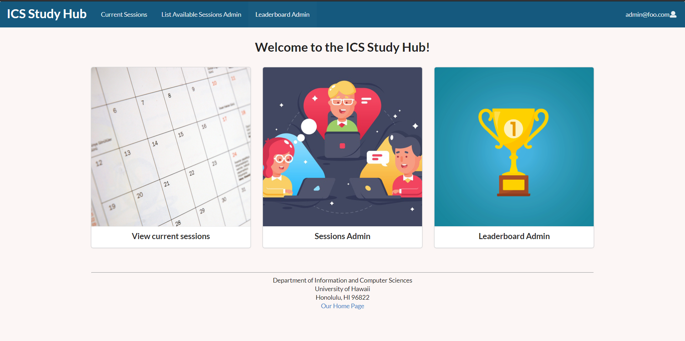

This is the group project that was assigned in ICS 314 for the final project. In this project, we have to create a website application for the student that they can create or join a study session with others, each user can create their own account, and create a session for help, also there is a calendar page which user will be able to check all the session that is available. By attendant the study session, the student can earn a point and there is a leaderboard page to show who has the highest point. In this group project, we use all the frameworks work that we learn about in ICS 314, to create the UI and functionality of the website. I’m in charge of doing the calendar page and the introduction site of our application.

In this project, I learn how to use the knowledge to create a real site, and also how to work more efficiently as a group. It really helps me in improving the skill using framework and Github, which is very important for future experience.

For more information, please visit our project on <a href="https://github.com/ics-study-hub/ics-study-hub"><i class="large github icon"></i>Github</a> or our project <a href="https://ics-study-hub.github.io/">home page</a>.
