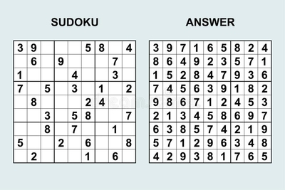

This project is one of the interesting assignments from ICS 211 which we have to think of an algorithm to solve given sudoku. The requirement of this project is to use a recursive function that can solve given sudoku, the function should be able to solve each sudoku block by block, and we have to create a test to check if the function has no bug and is solving the sudoku.

The hardest part of this project is to think of a recursive algorithm that can solve the sudoku, which I have to span lots of hours to think and break down which step is needed in each line of code. After I build up a general idea of an algorithm, I have to write all the class, and function that is needed for this program, such as the sudoku only takes the hex decimal, and the size of the sudoku is 16*16.

After this project, I feel I learn a lot about recursive algorithms, which is how is every step working during the recursive process, I believe this is a very important experience during my career because sometimes recursive function runtime then the regular way we solve the problem. 
 
Source: <a href="https://github.com/ShengT-Jin/sudokusolver"><i class="large github icon"></i>sudoku/solver</a>
