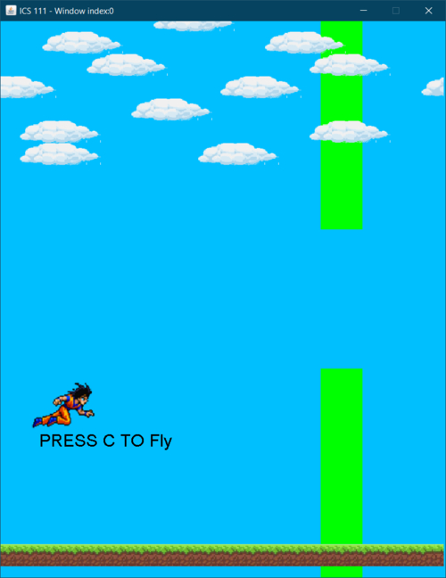

This is the final project for the ICS 111, this is also the first class that gets me to start code. The requirements of this project are to create a minigame in java and use things you learn as much as you can. For this project, the idea of the game is very important, by that time, the game flappy bird is very popular, and I decide to make the other version of flappy bird.

During the process of making the game, I use a lot of strategies that I learn in ICS111, such as the EZ java, which is the class that the professor creates for ICS111 students to give us an easy start with coding. I decided to use Goku as the game character since I like to watch Dragonball. In the game, the player and press C to start the game, and use C to jump.

After this project, it gives me more practice on typing code in java, and I’m being able to use lots of different methods that is been provide by java to solve my problem.

Source: <a href="https://github.com/ShengT-Jin/flappygoku"><i class="large github icon"></i>flappy/goku</a>

