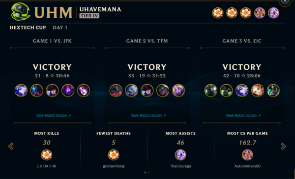

League of Legends is a multiplayer online battle arena video game developed and published by Riot Games for Microsoft Windows and macOS. League of Legends has reached a total of 115 Million monthly players according to recent data and has become the King of Games. This game requires the player to understand each champion’s skill and know-how to use them, also the map awareness to able to defeat the enemy.

Clash is a special tournament, which will queue 8 teams together and fight for the champion. I’ve been group up with my friend to join this tournament. In the game, the role I play is attack damage carried call ADC that in the bottom lane of the map. I have to cooperate with my friend to push the enemy’s turret and win the game.

From the clash, I learn that teamwork is extremely important during cooperation, each people have their own responsibility to do during the game. Also, communication is also very important so your teammate will not be misleading during the game.

Source: <a href="https://na.leagueoflegends.com/en/featured/clash#/"><i class="large github icon "></i>clash</a>

